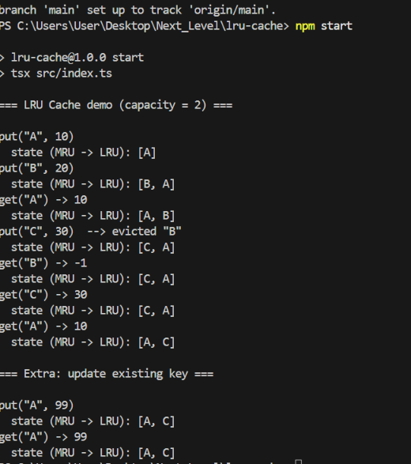
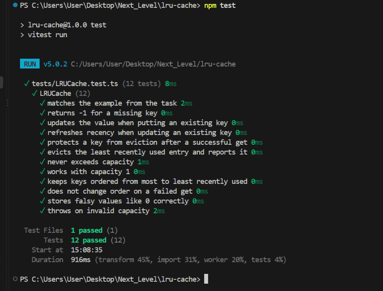

# LRU Cache (TypeScript)

A Least Recently Used (LRU) cache with **O(1) average** `get` and `put`, written in TypeScript with no runtime dependencies.

## API

```ts
const cache = new LRUCache<string, number>(2); // capacity must be a positive integer

cache.put("A", 10); // insert or update a key/value pair
cache.get("A"); // -> 10 (and "A" becomes the most recently used)
cache.get("Z"); // -> -1 (key not found)
```

| Method                   | Behavior                                                                                                                                                                                                               |
| ------------------------ | ---------------------------------------------------------------------------------------------------------------------------------------------------------------------------------------------------------------------- |
| `new LRUCache(capacity)` | Throws if `capacity` is not a positive integer.                                                                                                                                                                        |
| `get(key)`               | Returns the stored value, or `-1` if the key does not exist. A successful `get` makes the key the most recently used.                                                                                                  |
| `put(key, value)`        | Inserts a new pair or updates an existing one and marks it most recently used. If capacity is exceeded, the least recently used entry is removed. Returns the evicted key (or `null`), which the demo uses for output. |
| `keys()`                 | Returns keys ordered from most to least recently used (used by the demo and tests).                                                                                                                                    |
| `size`                   | Current number of entries.                                                                                                                                                                                             |

## Data structures used and why

The cache combines two structures:

1. **Hash map (`Map<key, Node>`)**: gives O(1) average lookup of any key. Each map value points directly to that key's node in the linked list, so no searching is needed.
2. **Doubly linked list**: stores the entries in recency order. Because every node knows both its `prev` and `next` neighbor, a node can be unlinked and re-inserted at the front in O(1) without traversing the list.

Neither structure works alone. A map alone has no cheap way to find the least recently used entry. A list alone needs O(n) to find a key. Together, the map finds the node and the list reorders it, both in O(1).

The list uses two **dummy sentinel nodes** (`head` and `tail`). They remove the special cases for inserting into or removing from an empty list or at either end.

## How LRU ordering is maintained

```
head <-> [most recent] <-> ... <-> [least recent] <-> tail
```

- `head.next` is always the **most recently used** entry.
- `tail.prev` is always the **least recently used** entry.
- **`get(key)`**: look up the node in the map. If found, unlink it and re-insert it right after `head`, then return its value. If not found, return `-1`.
- **`put(key, value)`**: if the key exists, update its value and move it to the front. Otherwise create a node, insert it after `head` and add it to the map. If the size now exceeds capacity, remove `tail.prev` from the list and delete its key from the map. That is the LRU eviction.

## Complexity

| Operation | Time             | Notes                                                                    |
| --------- | ---------------- | ------------------------------------------------------------------------ |
| `get`     | **O(1)** average | Map lookup + constant-time pointer updates                               |
| `put`     | **O(1)** average | Map lookup/insert + constant-time pointer updates + at most one eviction |

**Space: O(capacity)**. The cache never holds more than `capacity` nodes and map entries. Each entry uses one list node and one map slot.

The word "average" comes from the hash map, whose operations are O(1) on average.

## Project structure

```
lru-cache/
├── src/
│   ├── LRUCache.ts   # implementation
│   └── index.ts      # demo that prints real output
├── tests/
│   └── LRUCache.test.ts
├── screenshots/
│   ├── output.png    # demo output
│   └── tests.png     # passing test run
├── package.json
├── tsconfig.json
└── README.md
```

## How to run

Requires Node.js 18 or newer.

```bash
git clone https://github.com/FahimFaysalNirjhar/LRU-Cache.git
cd LRU-Cache
npm install

npm start      # runs the demo (src/index.ts)
npm test       # runs the unit tests
npm run build  # optional: compile to dist/
```

## Example output

Running `npm start` prints every operation with its returned value, the LRU eviction, and the recency order after each step (most recent first). This output is generated by the implementation, not written by hand.

```
=== LRU Cache demo (capacity = 2) ===

put("A", 10)
  state (MRU -> LRU): [A]
put("B", 20)
  state (MRU -> LRU): [B, A]
get("A") -> 10
  state (MRU -> LRU): [A, B]
put("C", 30)  --> evicted "B"
  state (MRU -> LRU): [C, A]
get("B") -> -1
  state (MRU -> LRU): [C, A]
get("C") -> 30
  state (MRU -> LRU): [C, A]
get("A") -> 10
  state (MRU -> LRU): [A, C]
```

Screenshot of the run:



## Tests

`npm test` runs 12 unit tests covering the example from the task, missing keys, updating existing keys, recency refresh on `get` and `put`, eviction order, the capacity-1 edge case, falsy values, and invalid capacity.


